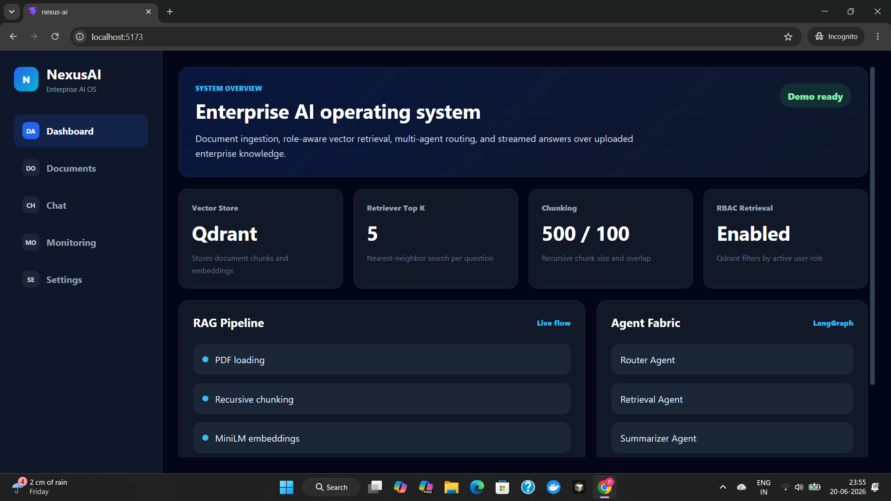
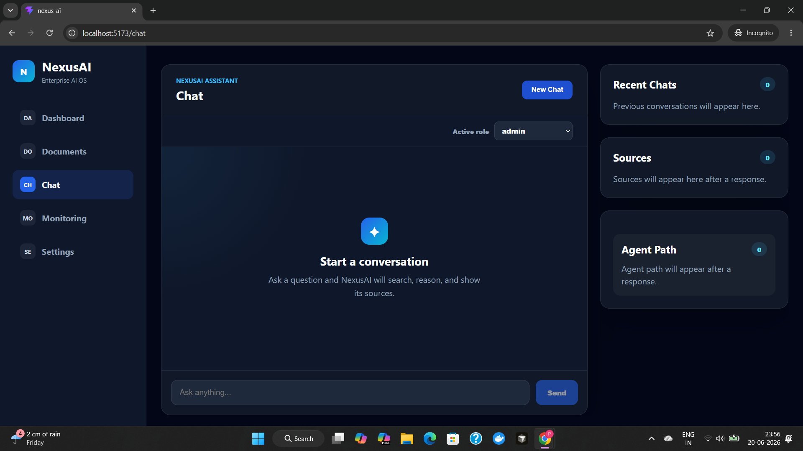
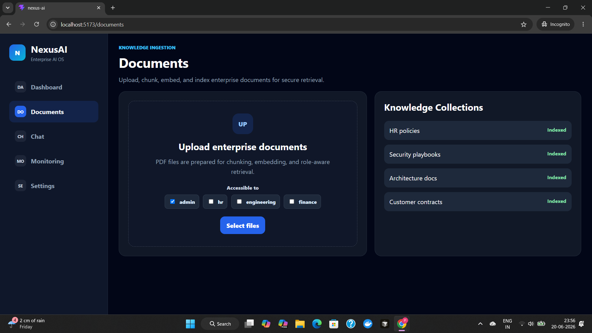
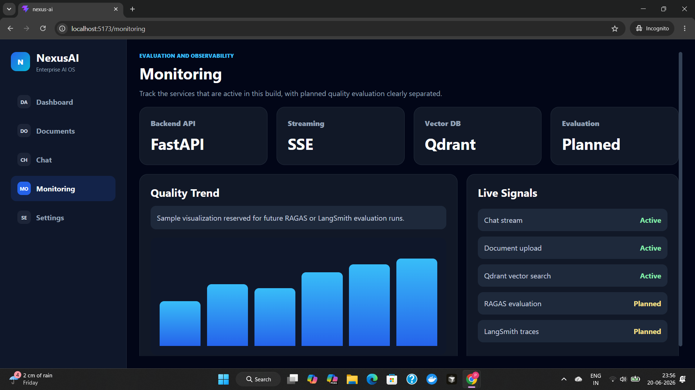
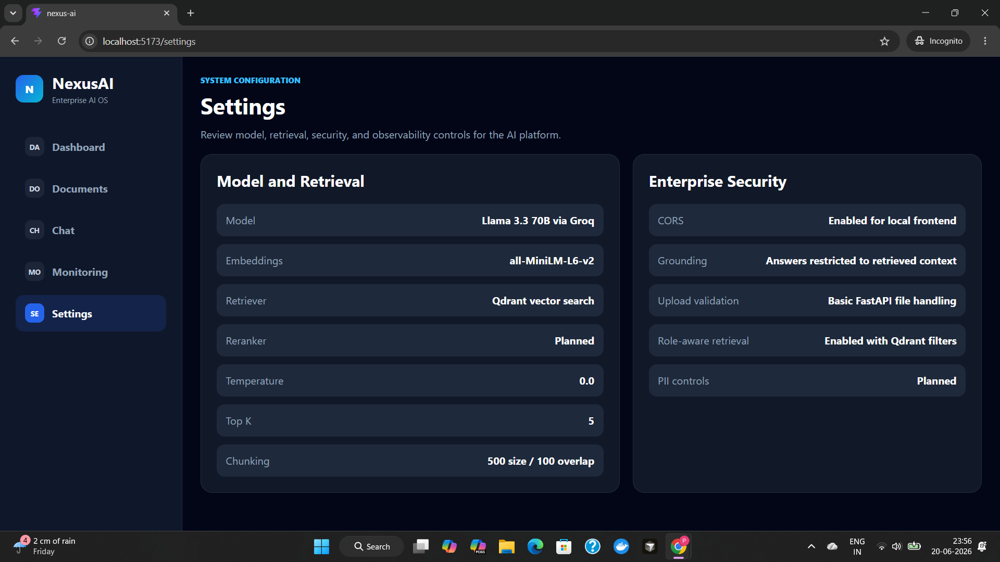

# NexusAI Platform

Enterprise-grade Retrieval-Augmented Generation (RAG) platform for private document intelligence.

NexusAI enables organizations to upload internal documents, index them into a vector database, and interact with them through a governed conversational AI interface. The platform combines document ingestion, role-based access control (RBAC), vector retrieval, LangGraph agent orchestration, and real-time streaming responses.

---

## Features

### Document Ingestion

* Upload PDF documents through a web interface
* Automatic text extraction and processing
* Recursive chunking for retrieval optimization
* Embedding generation using Sentence Transformers
* Vector indexing in Qdrant

### Retrieval-Augmented Generation (RAG)

* Dense vector similarity search
* Context-aware document retrieval
* Source citation generation
* Metadata-aware retrieval
* Grounded answer generation

### Role-Based Access Control (RBAC)

* Document-level access permissions
* Role-aware retrieval filtering
* Configurable user roles

  * Admin
  * HR
  * Engineering
  * Finance

### Agent Workflow

Multi-step LangGraph workflow:

Router → Retrieval → Summarizer → Critic

The workflow:

1. Routes incoming user queries
2. Retrieves relevant document chunks
3. Generates grounded responses
4. Performs response validation before returning results

### Conversational AI Experience

* Real-time streaming responses using SSE
* Source citations
* Agent execution trace visualization
* Recent conversation history
* Session management

### Monitoring

* Service health overview
* Streaming service visibility
* Vector database status
* Future evaluation integration placeholders

---

## Screenshots

### Dashboard

System overview showing the retrieval pipeline, vector database configuration, RBAC retrieval settings, and LangGraph agent architecture.



### Conversational AI Assistant

Streaming chat interface with role selection, source citations, recent conversations, and agent execution paths.




### Document Ingestion & RBAC

Upload enterprise documents and configure role-based access permissions before indexing.



---

### Monitoring & Observability

Track active platform services and future evaluation integrations.



---

### Settings

Application and platform configuration.



---

## Architecture

```text
Frontend (Vue + Vite + Pinia)
        |
        | REST APIs
        | SSE Streaming
        v
Backend (FastAPI)
        |
        | LangGraph Workflow
        | Router → Retrieval → Summarizer → Critic
        v
RAG Layer
        |
        | PDF Processing
        | Recursive Chunking
        | Embeddings
        | Metadata Filtering
        v
Qdrant Vector Database
```

---

## Technology Stack

### Frontend

* Vue 3
* Vite
* Pinia
* Vue Router

### Backend

* FastAPI
* Python
* Server-Sent Events (SSE)

### AI & Retrieval

* LangGraph
* LangChain
* Groq API
* Llama 3.3
* Sentence Transformers
* Qdrant

### Infrastructure

* Docker Compose
* Redis
* Qdrant

---

## Project Structure

```text
nexus-ai/
│
├── backend/
│   ├── app/
│   │   ├── agents/
│   │   ├── api/
│   │   ├── services/
│   │   ├── models/
│   │   └── uploads/
│   │
├── frontend/
│   ├── src/
│   │   ├── components/
│   │   ├── pages/
│   │   ├── stores/
│   │   └── router/
│
├── docs/
│   └── screenshots/
│       ├── dashboard.png
│       ├── documents.png
│       ├── chat.png
│       ├── monitoring.png
│       └── settings.png
│
├── docker-compose.yml
└── README.md
```

---

## How It Works

### Document Indexing Flow

```text
PDF Upload
    ↓
PDF Loader
    ↓
Recursive Chunking
    ↓
Embedding Generation
    ↓
Qdrant Indexing
```

### Query Flow

```text
User Question
      ↓
Router Agent
      ↓
Role-Aware Retrieval
      ↓
Qdrant Search
      ↓
Summarizer Agent
      ↓
Critic Agent
      ↓
Streaming Response
```

---

## Local Setup

### 1. Start Infrastructure

```bash
docker compose up qdrant redis
```

Qdrant Dashboard:

```text
http://localhost:6333/dashboard
```

---

### 2. Configure Environment

Create:

```text
backend/.env
```

```env
GROQ_API_KEY=your_groq_api_key
```

---

### 3. Start Backend

```bash
cd backend

uvicorn app.main:app \
  --host 0.0.0.0 \
  --port 8000 \
  --reload
```

Backend:

```text
http://localhost:8000
```

---

### 4. Start Frontend

```bash
cd frontend

npm install
npm run dev
```

Frontend:

```text
http://localhost:5173
```

---

## Demo Workflow

### RBAC Retrieval Demo

1. Upload an HR document.
2. Assign role access as `hr`.
3. Open Chat.
4. Select active role as `engineering`.
5. Ask a question about the HR document.
6. Observe that no HR-only sources are retrieved.
7. Switch role to `hr`.
8. Ask the same question.
9. Observe grounded answers and source citations.

---

## Current Capabilities

* PDF document ingestion
* Recursive chunking
* Embedding generation
* Vector search with Qdrant
* LangGraph orchestration
* Source citations
* Agent path visualization
* Role-based retrieval filtering
* Streaming chat responses
* Conversation history
* Monitoring dashboard

---

## Roadmap

### Retrieval Improvements

* Hybrid Search (Dense + BM25)
* Cross-Encoder Re-ranking

### Security & Governance

* Prompt Injection Detection
* PII Detection & Redaction
* Audit Logging
* Tenant Isolation

### Evaluation & Observability

* RAGAS Evaluation Pipeline
* LangSmith Tracing
* Retrieval Metrics Dashboard
* Latency Tracking

### Platform Enhancements

* Persistent Chat Sessions
* Document Management Portal
* Re-indexing Support
* Source Analytics

---

## Future Enhancements

* Multi-document collections
* Knowledge graph retrieval
* Agent memory
* Multi-modal document support
* Enterprise authentication (SSO)

---

## License

MIT License
